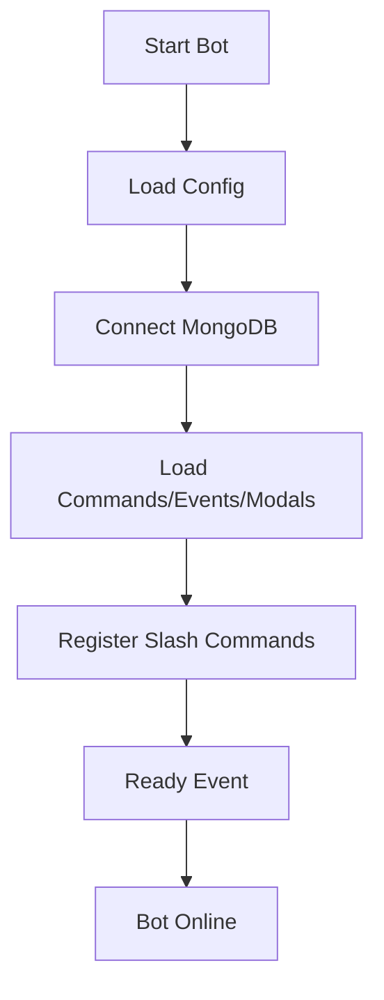
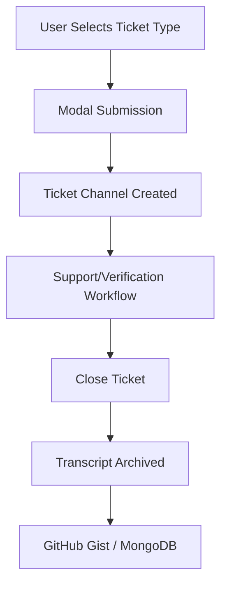
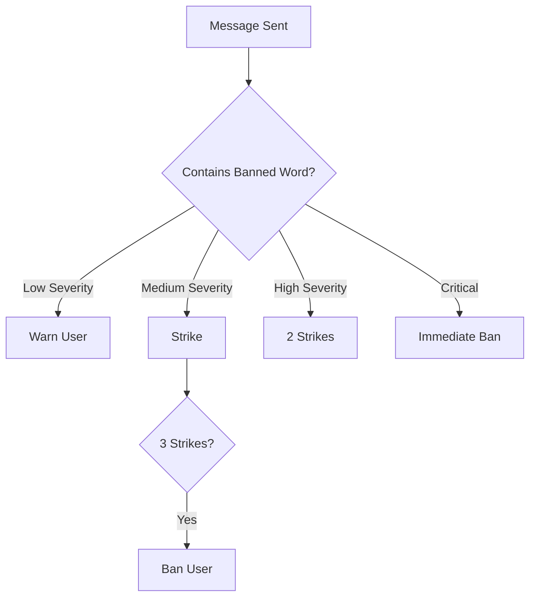
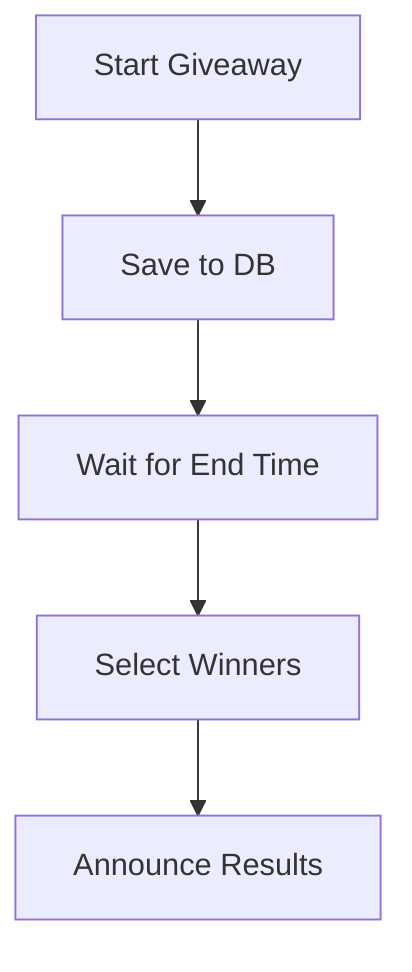

# Architecture Overview

Unity Bot is a modular, event-driven Discord bot built with **Node.js** and **discord.js v14**, designed around **subsystems** that can scale independently while sharing a common persistence layer in MongoDB. This document describes the system structure, data flows, and subsystem responsibilities.

---

## ⚙️ Entrypoint
- **`index.js`** bootstraps the bot.
  - Initializes Discord client with intents.
  - Loads commands, events, and modals via dynamic loaders.
  - Registers slash commands with the Discord API.
  - Routes interactions to the correct command or modal.

---

## 🧩 Subsystems

### 🎟 Ticketing & Verification
- **Flow**: Dropdown → modal → ticket channel → support/verification → transcript archive.
- **Features**:
  - Multi-ticket category configuration.
  - Verification tickets for onboarding.
  - Staff pinging with cooldowns.
  - Close & archive with transcript export.
- **Persistence**: `Ticket`, `TicketTranscript` schemas.
- **Transcripts**: Exported to GitHub Gist, fallback to MongoDB.
- **Impact**: 1000+ transcripts archived across servers.

---

### 🛡 Moderation
- **Commands**: `/ban`, `/unban`, `/idBan`, `/idUnban`, `/strike`, `/verifyUser`, `/clear`.
- **Events**: `checkBannedWords`, `messageDelete`, `messageUpdate`.
- **Escalation**:
  - Warnings for low severity.
  - Strikes for medium severity.
  - Auto-ban at 3 strikes or critical severity.
- **Persistence**: `Infractions` schema.
- **Transparency**: Logs for all actions, infractions reset post-ban.

---

### 🏆 Leveling System
- **Tracking**: Increments message count on `messageCreate`.
- **Features**:
  - Progression via `levels.js` thresholds.
  - Leaderboard (`/leaderboard`).
  - Personal progress (`/levelProgress`).
  - Admin overrides (`/addMessages`, `/removeMessages`, `/resetAllMessages`).
  - Opt in/out of notifications.
- **Persistence**: `UserSchema`.
- **Utils**: `levelUtils.js` centralizes progression logic.

---

### 🎭 Roles & Counts
- **Reaction Roles**:
  - Users self-assign roles by reacting.
  - Stored in `RoleReactionMessage` schema.
- **Role Counts**:
  - Voice channels display live member counts for roles.
  - Stored in `RoleCountConfig` schema.

---

### 🎁 Giveaways
- **Commands**: `/sendGiveawayMessage`.
- **Persistence**: `Giveaway` schema.
- **Lifecycle**:
  - Giveaway started and saved to DB.
  - Bot restarts → resumes giveaway.
  - Ends at scheduled time, selects winners.

---

### 📊 Logging & Lifecycle
- **Guild Events**:
  - `guildMemberAdd` → welcome message, log, update member count.
  - `guildMemberRemove` → departure log, update member count.
- **Message Logs**:
  - `messageDelete` → logs author, content, timestamp.
  - `messageUpdate` → logs before/after edits.
- **Startup Recovery**:
  - Restores giveaways and reaction roles on `ready`.
  - Updates UTC channels with `readyUtc`.

---

## 📂 Persistence Layer
- **Guild Configs**: Centralized configuration per guild (`config.js`).
- **Users**: Levels and message counts.
- **Infractions**: Strikes and warnings.
- **Tickets & Transcripts**: Support history.
- **Giveaways**: Entrants and winners.
- **Role Systems**: Reaction roles and role counts.

---

## 🔗 External Integrations
- **Discord API** → Slash commands, modals, events, embeds.
- **MongoDB** → Persistence of all systems.
- **GitHub Gist** → Ticket transcripts.
- **Discord-html-transcripts** → Export formatting.
- **date-fns / node-cron** → UTC scheduling.
- **fast-levenshtein** → Fuzzy banned word matching.
- **GitHub Pages** → Landing page hosting.

---

## 💡 Strengths
- Modular subsystems with clear separation of concerns.
- Resilient startup recovery (state restoration).
- Configurable per guild.
- Transparent logging for accountability.
- Production-proven: active across multiple servers.

---

## 🔮 Future Work
- Add moderation commands: `/unstrike`, `/warn`, `/unwarn`, `/timeout`, `/untimeout`, `/kick`, `/set-banned-words`.
- Owner-only commands: `/reload`, `/shutdown`, `/deploy`.
- Schema consolidation for efficiency.
- Unified config management (removes + lists).
- Expanded logging (channels, actions).
- Leaderboard pagination & search.
- Configurable strike policies.
- Multi-ticket configurations.

---
