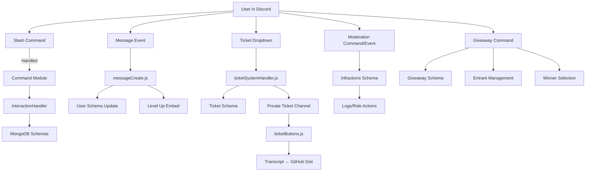

# Unified Discord Bot - System Architecture

## 🎯 Purpose

The Unified Discord Bot was built to **consolidate multiple bots into one modular system** for large-scale community management.  
Originally designed for **Kingdom 3743 (~900 members)**, it has been deployed across **8 servers**, providing:

- Centralized moderation and rules enforcement
- Gamified leveling and leaderboards
- Structured ticketing and support system
- Role verification and engagement utilities
- Event-driven engagement
- Scalable, secure infrastructure aligned with Discord’s permission model

---

## 🛠 Core Architecture Overview

The bot is a **modular, event-driven Node.js application** built with **discord.js v14** and backed by **MongoDB persistence**.

### 🔹 Entrypoint (index.js)
- Initializes `discord.js` client with intents (`Guilds`, `GuildMembers`, `GuildPresences`).
- Loads config, cooldowns, and cache.
- Bootstraps loaders:
  - **ComponentLoader** → buttons, dropdowns, modals
  - **EventLoader** → Discord event handlers
  - **RegisterCommands** → slash command registration via Discord REST API
- Defines a **centralized InteractionHandler** enforcing access control (`admin`, `owner`) and routing execution.

---

### 🔹 Commands
- Located under `/commands/` and organized by domain:
  - **Levels** → progression management (`leaderboard`, `add/remove messages`, `reset`, `yapCheck`).
  - **Moderation** → expanded suite (`idBan`, `idUnban`, `strike`, `set`, `unset`, `verifyUser`).
  - **Miscellaneous** → utility commands (`say`, `getUtc`).
  - **Engagement** → `/sendRolesSelect`, `/sendRules`, `/sendTicketSetup`, `/sendVerification`, `/startGiveaway`.
- Each command is a self-contained module with:
  - Metadata (`admin`, `owner` flags)
  - Slash command definition (`SlashCommandBuilder`)
  - Execution handler

---

### 🔹 Events
- Located under `/events/`.
- Handle lifecycle, moderation, and engagement:
  - **Messages** → `messageCreate.js` (leveling, moderation hooks), `messageDelete.js`, `messageUpdate.js`.
  - **Members** → `guildMemberAdd.js`, `guidlMemberRemove.js`.
  - **Reactions** → `reactionAdd.js`, `reactionRemove.js` (role handling, verification).
  - **Tickets** → `ticketSystemHandler.js` (creation), `ticketButtons.js` (management, transcripts).
  - **Other** → `checkBannedWords.js` (filtering), `ready.js` (startup), `readyUTC.js` (time sync), `updateRoleCount.js` (role stats).

---

### 🔹 Persistence (MongoDB via Mongoose)
- Schemas under `/schemas/`:
  - `User` → userId, messages, level, notificationsEnabled
  - `Infractions` → tracks warnings, strikes, bans
  - `Ticket` → ticket channel, user, guild, status, description
  - `TicketTranscript` → archived ticket metadata
  - `Giveaway` → entrants, prize, status, winners
  - `Config` → per-guild config (ticket categories, transcript channels)
  - `RoleReactionMessage` → maps reaction-based role messages
- Provides durable storage for **users, moderation logs, giveaways, tickets, and configs**.

---

### 🔹 Utilities
- Located under `/utils/`:
  - **Infrastructure** → `RegisterCommands.js`, `EventLoader.js`, `ComponentLoader.js`, `ReadFolder.js`.
  - **Features** → `createVerificationTicket.js` (verification workflow), `githubGistUtils.js` (ticket transcript upload), `levelUtils.js` (XP/level thresholds).

---

### 🔹 Data & Config
- `/data/levels.js` → defines progression thresholds.
- `/data/bannedWords.js` → banned word list for moderation.
- `/config.json` → bot token, Mongo URL, bot ID (**security critical**).
- `.env` → expected for sensitive overrides in production.

---

### 🔹 Infrastructure & Deployment
- **Hosting** → runs on VPS + Discloud platform.
- **Discloud Configs** → `discloud.config` + `/discloud/import/*` snapshots for deployment portability.
- **Backups** → stored in `/discloud/backup/`.
- Ensures reliability and portability across environments.

---

## 🔗 System Data Flow

---

## 🧩 Subsystem Breakdown

Subsystem	Implementation	Purpose
entrypoint	Node.js + discord.js	Bootstraps client, loaders, and handlers
commands	SlashCommandBuilder modules	Moderation, leveling, verification, giveaways, misc
events	Event-driven handlers	Lifecycle hooks, engagement, moderation, ticketing, verification
persistence	MongoDB + Mongoose	Stores users, infractions, giveaways, tickets, configs, transcripts
support_system	Tickets + buttons + modals	Community support, verification, transcripts
moderation	Expanded commands + infractions schema	Full admin controls, strikes, bans, verification
engagement	Role menus, giveaways, UTC utilities	Enhances community interaction
data	Static configs	Levels, banned words, rules
infra	VPS + Discloud hosting	Reliable, portable deployment
security	Discord permission model + flags	Role-based access control, cooldowns, safe execution

---

## ⚡ Architecture Strengths

- **Unified system** → replaces multiple bots with one scalable bot
- **Expanded moderation** → strikes, bans, verification, infractions logging
- **Gamification** → levels, leaderboards, recognition for active users
- **Support workflows** → full ticketing lifecycle with transcripts + GitHub Gist storage
- **Giveaway engine** → community engagement with persistent tracking
- **Role utilities** → self-assignable roles, live counts, verification system
- **Secure by design** → aligns with Discord’s built-in permissions & access model
- **Production-proven** → scaled to 900+ members, running in 8 servers
- **Deployment-ready** → Discloud integration, VPS hosting, backups
- **Extensible** → modular structure for commands, events, and components