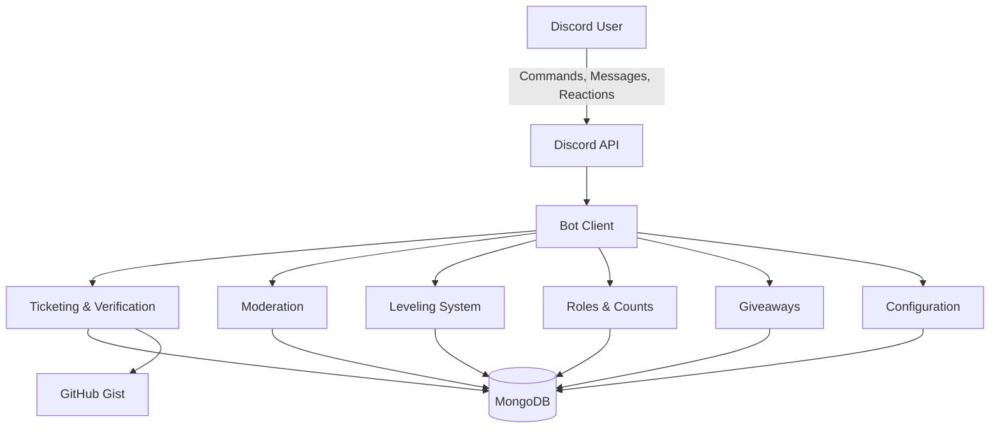
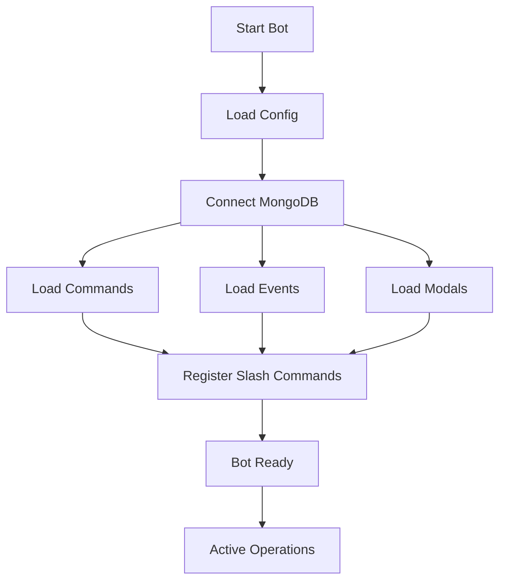
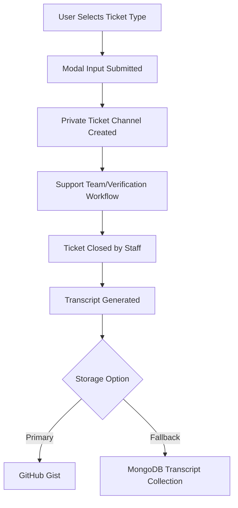
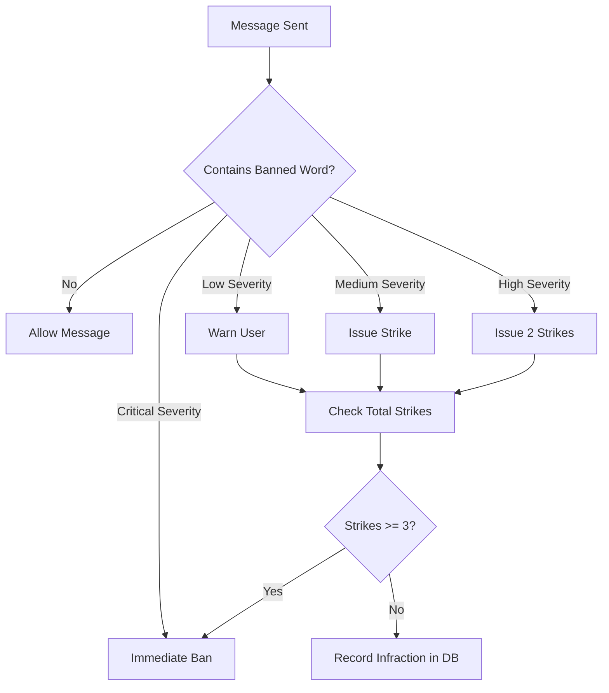
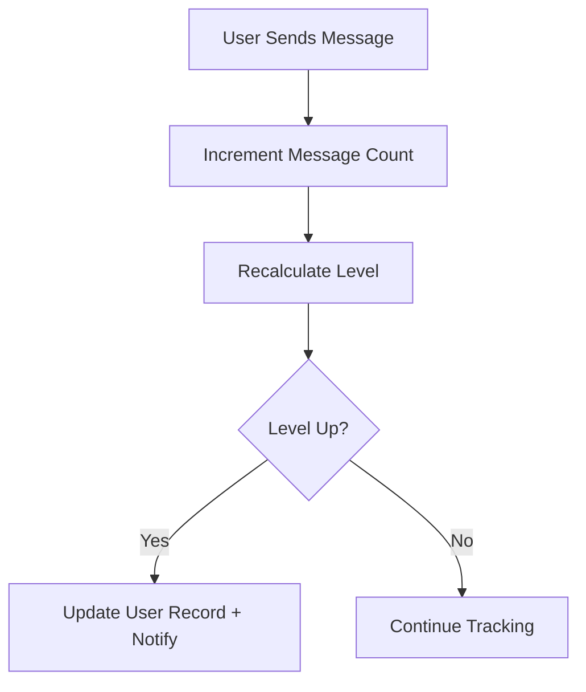
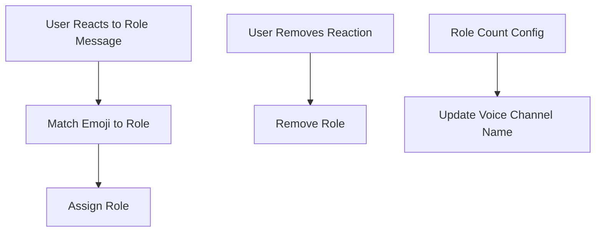
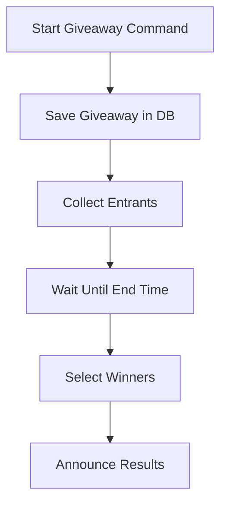
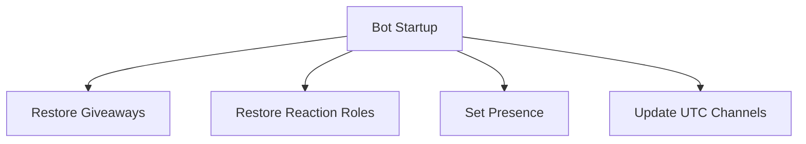

# Unity Bot - System Architecture

## 🎯 Purpose

Unity Bot is a **modular, event-driven Discord bot** built with **Node.js** and **discord.js v14**, designed around **subsystems** that scale independently while sharing a common persistence layer in **MongoDB**.

It has been deployed in production Discord servers, powering moderation, community engagement, and automation workflows.

---

## 🌐 System-Wide Overview

---

## ⚙️ Entrypoint

* **`index.js`** bootstraps the bot.

  * Initializes the Discord client with required intents.
  * Connects to MongoDB.
  * Loads commands, events, and modals via loaders in `utils/`.
  * Registers slash commands with Discord’s API.
  * Routes interactions to the appropriate handler.

---

## 🧩 Subsystems

### 🎟 Ticketing & Verification

* **Flow**: Dropdown → modal → ticket channel → support/verification → close → transcript archive.
* **Features**:

  * Configurable ticket categories per guild.
  * Verification tickets for onboarding.
  * Buttons to ping staff (with cooldown), verify users, close tickets.
  * Closed tickets archived with transcripts.
* **Persistence**: `Ticket`, `TicketTranscript` schemas.
* **Transcripts**: Stored via GitHub Gist integration, fallback to MongoDB.
* **Impact**: 1000+ transcripts archived across production servers.

---

### 🛡 Moderation

* **Commands**: `/ban`, `/unban`, `/idBan`, `/idUnban`, `/strike`, `/verifyUser`, `/clear`.
* **Events**: `checkBannedWords`, `messageDelete`, `messageUpdate`.
* **Escalation Policy**:

  * Low severity → warning.
  * Medium severity → strike.
  * High severity → 2 strikes.
  * Critical severity → immediate ban.
* **Persistence**: `Infractions` schema.
* **Transparency**: Logged actions, auto-reset infractions post-ban.
* **Rate-Limiting**: Cooldowns and Discord permission checks prevent abuse.

---

### 🏆 Leveling System

* **Tracking**: Each message increments XP (`messageCreate` event).
* **Features**:

  * Level thresholds defined in `data/levels.js`.
  * `/leaderboard` shows top 10 members.
  * `/levelProgress` shows current progress toward next level.
  * Admin overrides: `/addMessages`, `/removeMessages`, `/resetAllMessages`.
  * Opt-in/out of level-up notifications.
* **Persistence**: `UserSchema`.
* **Utils**: `levelUtils.js` centralizes XP → level conversion.

---

### 🎭 Roles & Counts

* **Reaction Roles**:

  * Users add/remove reactions on role-select embeds.
  * Automatically grants or removes roles.
  * Stored in `RoleReactionMessage`.
* **Role Counts**:

  * Voice channels dynamically renamed to show live member counts.
  * Config stored in `RoleCountConfig`.

---

### 🎁 Giveaways

* **Commands**: `/sendGiveawayMessage`.
* **Persistence**: `Giveaway` schema (title, prize, winners, end time).
* **Lifecycle**:

  * Giveaway started → DB record created.
  * Participants added during runtime.
  * On scheduled end → winners selected automatically.
  * Giveaway state restored on restart.

---

### 📊 Logging & Lifecycle

* **Guild Events**:

  * `guildMemberAdd` → welcome embed, join log, update member count.
  * `guildMemberRemove` → departure log, update member count.
* **Message Logs**:

  * `messageDelete` → logs deleted content.
  * `messageUpdate` → logs old vs new content.
* **Startup Recovery**:

  * `ready` restores giveaways and reaction roles.
  * `readyUtc` updates configured UTC channels.

---

## 📂 Persistence Layer

* **Guild Configs**: Ticket categories, log channels, role counts, reaction roles.
* **Users**: Levels, XP, message counts, notification preferences.
* **Infractions**: Strikes, warnings, bans.
* **Tickets & Transcripts**: Active tickets + archived support history.
* **Giveaways**: Entrants, winners, metadata.
* **Role Systems**: Reaction roles, role count configs.

---

## 🔗 External Integrations

* **Discord API** → Slash commands, modals, embeds, events.
* **MongoDB** → Persistent datastore for all systems.
* **GitHub Gist** → Ticket transcripts.
* **discord-html-transcripts** → Transcript formatting.
* **date-fns / node-cron** → UTC scheduling + cron jobs.
* **fast-levenshtein** → Fuzzy matching for banned words.
* **GitHub Pages** → Public landing page.

---

## 💡 Strengths

* Modular subsystems with clear separation of concerns.
* Recovery after restarts (reaction roles, giveaways).
* Configurable per guild.
* Transparent logs for moderation and support.
* Scalable, production-proven in multiple servers.
* Full audit trail with transcripts and infractions.

---

## 🔮 Future Work

* Moderation: `/unstrike`, `/warn`, `/unwarn`, `/timeout`, `/untimeout`, `/kick`, `/set-banned-words`.
* Owner-only commands: `/reload`, `/shutdown`, `/deploy`.
* Consolidate schemas for efficiency.
* Unified config management (removes + list in same command).
* Expanded channel logging.
* Leaderboard pagination + searchability.
* Configurable strike escalation policies.
* Multi-ticket configurations.
* Automated penetration testing & anomaly detection.
