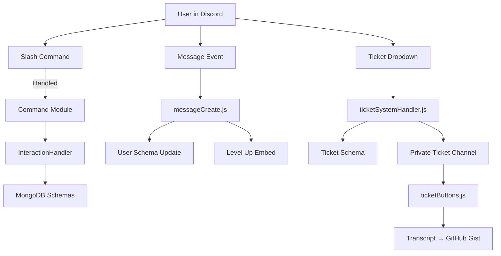

# Unified Discord Bot - System Architecture

## 🎯 Purpose

The Unified Discord Bot was built to **consolidate multiple bots into one modular system** for large-scale community management.  
Originally designed for **Kingdom 3743 (~900 members)**, it has been deployed across **8 servers**, providing:

- Centralized moderation and rules enforcement
- Gamified leveling and leaderboards
- Structured ticketing and support system
- Event-driven engagement
- Scalable, secure infrastructure aligned with Discord’s permission model

---

## 🛠 Core Architecture Overview

The bot is designed as a **modular, event-driven Node.js application** built with **discord.js v14** and backed by **MongoDB persistence**.

### 🔹 Entrypoint (index.js)
- Initializes `discord.js` client with core intents (`Guilds`, `GuildMembers`, `GuildPresences`).
- Loads config, cooldowns, and cache.
- Bootstraps loaders:
  - **ComponentLoader** → buttons, dropdowns, modals
  - **EventLoader** → Discord event handlers
  - **RegisterCommands** → slash command registration via Discord REST API
- Defines a **centralized InteractionHandler** to enforce access control (`admin`, `owner`) and route execution.

---

### 🔹 Commands
- Organized under `/commands/` by domain (`levels/`, `moderation/`, `misc/`).
- Each command is a self-contained module with:
  - Metadata (`admin`, `owner` flags)
  - Slash command definition (`SlashCommandBuilder`)
  - Execution handler
- Examples:
  - `/send-rules` → Admin-only rules enforcement
  - `/leaderboard` → Displays top chatters by level and messages

---

### 🔹 Events
- Located under `/events/`.
- Handle core lifecycle and engagement hooks:
  - `messageCreate.js` → Tracks user activity, updates messages/levels, sends level-up embeds
  - `ticketSystemHandler.js` → Ticket creation via dropdown + modal
  - `ticketButtons.js` → Ticket management: support pings, user verification, closure, transcripts

---

### 🔹 Persistence (MongoDB via Mongoose)
- Schemas under `/schemas/`:
  - `User` → userId, messages, level, notificationsEnabled
  - `Ticket` → ticket channel, user, guild, status, description
  - `Config` → per-guild config (ticket categories, transcript channels)
  - `TicketTranscript` → archived ticket metadata
- Provides durable storage for community activity and support workflows.

---

### 🔹 Data & Config
- `/data/levels.js` → defines progression thresholds
- `/data/bannedWords.js` → moderation data
- `/config.json` → bot secrets and app IDs (with `.env` for sensitive data)

---

## 🔗 System Data Flow

---

## 🧩 Subsystem Breakdown

Subsystem	Implementation	Purpose
entrypoint	Node.js + discord.js	Bootstraps client, loaders, and handlers
commands	SlashCommandBuilder modules	Moderation, leveling, misc bot features
events	Event-driven handlers	Lifecycle hooks, engagement, ticketing
persistence	MongoDB + Mongoose	Stores users, tickets, configs, transcripts
support_system	Tickets + buttons + modals	Community support, verification, transcripts
data	Static configs	Levels, banned words, rules
infra	Paid VPS hosting	Scaling beyond free-tier; reliable uptime
security	Discord permission model + flags	Role-based access control, cooldowns, safe execution

---

## ⚡ Architecture Strengths

- **Unified system** → replaces multiple bots with one scalable bot
- **Gamification** → levels, leaderboards, recognition for active users
- **Support workflows** → full ticketing lifecycle with transcripts + GitHub Gist storage
- **Secure by design** → aligns with Discord’s built-in permissions & access model
- **Production-proven** → scaled to 900+ members, running in 8 servers
- **Extensible** → modular structure for commands, events, and components

