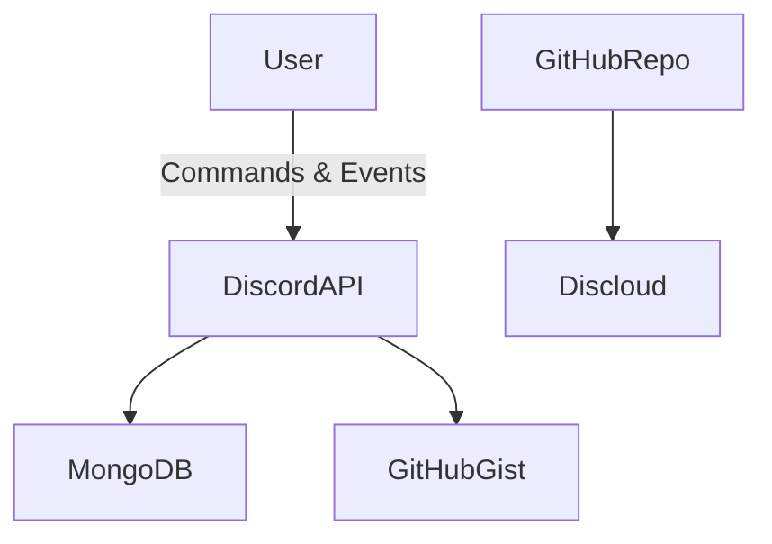

# Unified Discord Bot - Integrations Overview

## 🎯 Purpose

The Unified Discord Bot integrates with several **third-party services** to enable its modular community management features.  
These integrations power **commands, persistence, transcripts, and deployment workflows**.

---

## 🔑 Discord API (Core Platform)

- **Purpose:** Power all bot interactions (commands, events, role handling)
- **Integration:**
  - Library: `discord.js v14`
  - Gateway intents: `Guilds`, `GuildMembers`, `GuildPresences`, `MessageContent`, `Reactions`
  - Handlers: slash commands, buttons, dropdowns, modals, events
- **Features:**
  - Slash Commands (`/leaderboard`, `/idBan`, `/startGiveaway`)
  - Role/permission enforcement via Discord’s security model
  - Event-driven lifecycle (messages, reactions, tickets, verification)
- **Risks:**
  - Bot token exposure = total compromise (must be secured in `config.json` / `.env`)
  - Rate limits must be respected to avoid bans

---

## 🔑 MongoDB (Database)

- **Purpose:** Provide persistence across all features
- **Integration:**
  - ODM: Mongoose
  - Connection string (`MONGO_URL`) from `config.json` / `.env`
- **Stored Data:**
  - Users: XP, levels, notification settings
  - Infractions: strikes, warnings, bans
  - Tickets: active tickets, status, metadata
  - Ticket Transcripts: archived transcripts
  - Giveaways: prize, entrants, winners
  - Config: per-guild rules, ticket categories
  - RoleReactionMessages: reaction-role mappings
- **Risks:**
  - Mongo URL exposure = data breach
  - Improper schema validation could corrupt persistence

---

## 🔑 GitHub Gist (Transcript Archiving)

- **Purpose:** Store ticket transcripts externally for auditability
- **Integration:**
  - Utility: `utils/githubGistUtils.js`
  - API requests on ticket closure
- **Features:**
  - Permanent, shareable transcript URLs
  - Keeps Discord channels uncluttered
- **Risks:**
  - Public Gists may expose sensitive conversations
  - Should prefer **secret Gists** for private servers

---

## 🔑 Discloud Hosting (Deployment)

- **Purpose:** Simplify hosting and redeployment
- **Integration:**
  - Config: `discloud.config`
  - Snapshots: `/discloud/import/*`
  - Backups: `/discloud/backup/`
- **Features:**
  - Rapid deployment from GitHub
  - Rollback via imports/backups
  - Scales alongside VPS hosting for reliability
- **Risks:**
  - Config leaks could allow attackers to hijack deployments
  - Vendor lock-in for deployment workflows

---

## 📋 Integration Data Flow

---

## ⚡ Integration Strengths

- **Discord API** → native commands, events, role/permission security
- **MongoDB** → persistent storage for users, infractions, tickets, giveaways
- **GitHub Gist** → scalable ticket transcript archiving
- **Discloud Hosting** → deployment portability, backups, rollback safety
- **Security Alignment** → secrets stored in `config.json` / `.env`, role-based access enforced
