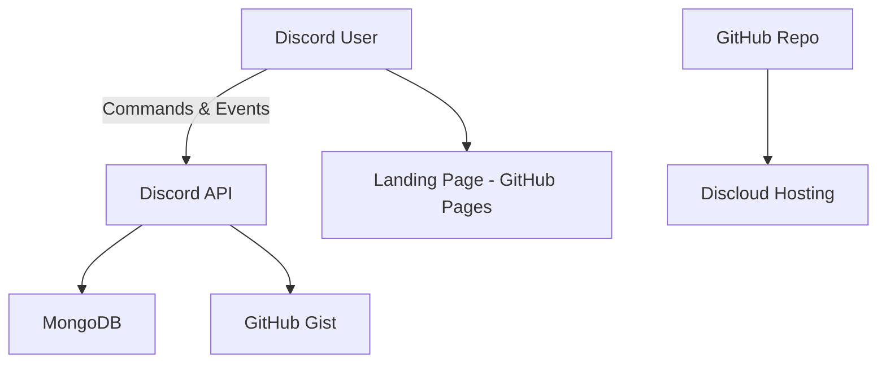

# Unified Discord Bot - Integrations Overview

## 🎯 Purpose

The Unified Discord Bot integrates with several **third-party services and libraries** to enable its modular community management features.  
These integrations power **commands, persistence, transcripts, scheduling, and deployment workflows**.

---

## 🔑 Discord API (Core Platform)

- **Purpose:** Power all bot interactions (commands, events, role handling).
- **Integration:**
  - Library: `discord.js v14`
  - Gateway intents: `Guilds`, `GuildMembers`, `GuildPresences`, `MessageContent`, `Reactions`
  - Handlers: slash commands, buttons, dropdowns, modals, events
- **Features:**
  - Slash Commands (`/leaderboard`, `/idBan`, `/sendGiveawayMessage`)
  - Role/permission enforcement via Discord’s security model
  - Event-driven lifecycle (messages, reactions, tickets, verification)
- **Risks:**
  - Bot token exposure = full compromise (must be secured in `.env`)
  - Must respect Discord API rate limits to avoid temporary bans

---

## 🔑 MongoDB (Database)

- **Purpose:** Provide persistence across all features.
- **Integration:**
  - ODM: Mongoose
  - Connection string (`MONGO_URL`) from `.env`
- **Stored Data:**
  - Users: XP, levels, notification settings
  - Infractions: warnings, strikes, bans
  - Tickets: active tickets, metadata
  - Ticket Transcripts: archived transcripts (1000+ stored)
  - Giveaways: prize, entrants, winners
  - Config: per-guild logs, tickets, UTC, roles
  - RoleReactionMessages: reaction-role mappings
  - RoleCountConfig: role-based voice channel counters
- **Risks:**
  - Mongo URL exposure = total data breach
  - Misconfigured schemas could corrupt data

---

## 🔑 GitHub Gist (Transcript Archiving)

- **Purpose:** Archive ticket transcripts externally for accountability.
- **Integration:**
  - Utility: `utils/githubGistUtils.js`
  - API requests on ticket closure
- **Features:**
  - Permanent, shareable transcript URLs
  - Keeps Discord servers uncluttered
  - Fallback to MongoDB if API fails
- **Risks:**
  - Public Gists could leak private conversations
  - Must always default to **secret Gists**

---

## 🔑 Discloud Hosting (Deployment)

- **Purpose:** Simplify hosting, scaling, and redeployment.
- **Integration:**
  - Config: `discloud.config`
  - Snapshots: `/discloud/import/*`
  - Backups: `/discloud/backup/`
- **Features:**
  - Rapid deployment from GitHub
  - Rollback via imports/backups
  - Deployed in tandem with VPS for resilience
- **Risks:**
  - Config leaks could allow hijacked deployments
  - Vendor lock-in for automated workflows

---

## 🔑 Additional Libraries

- **discord-html-transcripts** → export styled transcripts
- **date-fns / node-cron** → scheduling + UTC updates
- **fast-levenshtein** → fuzzy banned-word matching
- **GitHub Pages** → landing page hosting ([Unity Bot Landing Page](https://rushinski.github.io/Unity-Landing-Page/#tickets))

---

## 📋 Integration Data Flow

---

## ⚡ Integration Strengths

- **Discord API** → native commands, events, role/permission security.
- **MongoDB** → persistent storage across subsystems.
- **GitHub Gist** → external, auditable ticket archive.
- **Discloud Hosting** → simple deployment, backups, rollback.
- **Libraries** → modern ecosystem (`date-fns`, `node-cron`, `fast-levenshtein`).
- **Landing Page** → external showcase for features & ticketing.

---